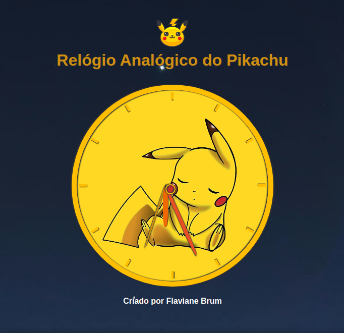
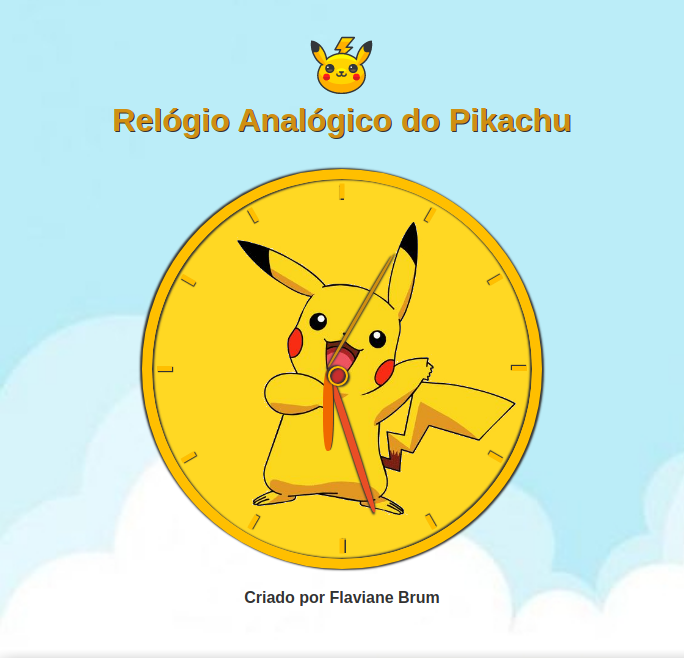
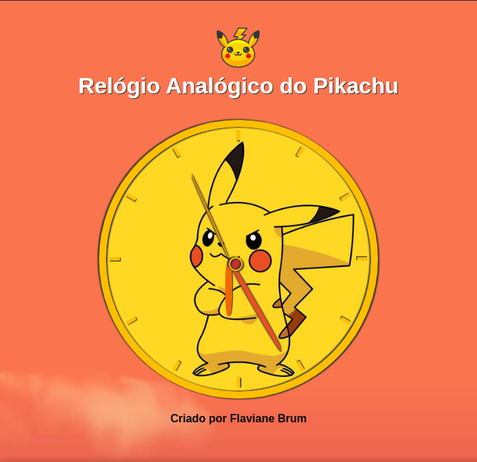

<h1 align="center">
 

 
Relógio analógico do Pikachu

<h2>:pencil: Sobre o projeto</h2>

Projeto desenvolvido para pôr em prática os conceitos aprendidos em Javascript Html5 e CSS3.

 

  <h2>:camera_flash: Screenshots das telas</h2>
  <h3  align="left">:new_moon: Horário da noite</h3>
  
    
  <h3 align="left" >:sunny: Horário da manhã</h3>
  
   <h3 align="left" >:first_quarter_moon_with_face: Horário da tarde</h3>
  

Você pode conferir o resultado final em: 

<h2> Features</h2>
 background  mudando de acordo com o horário. 

<h2> 🛠 Tecnologias </h2>
As seguintes ferramentas foram usadas na construção do projeto:

- HTML5
- CSS3
- Javascript

Made with :hearts: by Flaviane Brum.
